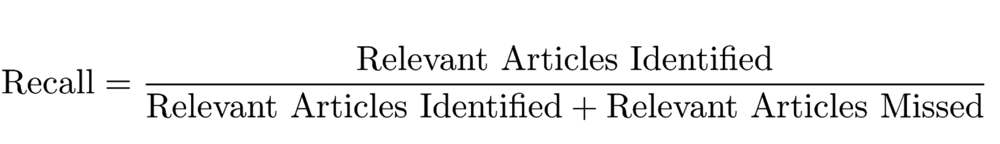

# Leveraging News Media for Situational Awareness

Helpful links:
 - [Presentation Deck](https://git.generalassemb.ly/bconnelly/project_4/blob/master/slideshow/News%20Aggregation%20Presentation.pdf)
 - [Model Notebooks](https://git.generalassemb.ly/bconnelly/project_4/tree/master/code%20and%20data)
 - [Flask App](https://git.generalassemb.ly/bconnelly/project_4/blob/master/server.py)
 - [Data](https://git.generalassemb.ly/bconnelly/project_4/tree/master/code%20and%20data/datasets)
 
Problem Statement:

During a major disaster, it is essential to provide the public and responders with relevant local news updates in order to gain situational awareness during the event.
During a disaster, news updates are coming from tens to hundreds of different sources, all in different formats, available from different websites, news channels etc., and it is often difficult to find what would be most helpful amid the chaos of other non-disaster related news and media.
There is currently no forum for rounding up and archiving relevant news for a live disaster event.
This project leverages news feeds relevant to specific disasters to create a webpage that presents these live feeds under one umbrella (on one page). This is similar to the Google News feature.

## Usage
### Dependencies
In order to run this app, the following libraries and their dependencies need to be installed:
- [Pandas](https://pandas.pydata.org/)
- [Scikit-learn](https://scikit-learn.org/stable/)
- [flask](http://flask.pocoo.org/)
- [newsapi-python](https://newsapi.org/docs/client-libraries/python)

Use installation instructions found on their own sites for more information.

### Usage
**Important: server.py and the scraping notebook need an API key entered in to function!**
Once you have installed a newsapi key into `server.py`, simply navigate to the folder containing `server.py` on command line and type `python server.py`, then open up [http://localhost:4000](http://localhost:4000) (default link, can be changed in `server.py`) to access the web app.

## The Process 

### The Data

Utilizing the [New York Times' API](https://www.google.com), we pulled over 6,000 linked articles related to six types of major disasters:

1. Blizzard
2. Earthquake
3. Hurricane
4. Fire 
5. Flood
6. Tornado

The [CSV files](https://git.generalassemb.ly/bconnelly/project_4/tree/master/code%20and%20data/datasets) had columns for Headline, Publishing Date, Snippet and a link to the article.

[Notebook containing code for scraping](https://git.generalassemb.ly/bconnelly/project_4/blob/master/code%20and%20data/01-scraping-code.ipynb)
To train our model, we created a new column in our data and labeled each entry in order to make sure the articles were relevevant to our objective. Our criteria for relevancy were

 - **1. Does this article appear to contain information that would be relevant to first responders during a disaster?**
 - **2. Was this article written about an ongoing disaster at the time of publication?** 
 
In order to determine if an article met our criteria we manually read through each headline and marked them in a new column. Articles were labeled as such:

- 1: relevant
- 0: not - relevant

## Modeling

Once our data was labeled we comapred our classes. Here we ran into the issue of *imbalanced classes*. Out of about 5,000 articles approximately 93% did not meet our criteria and 7% did. To address the issue, we trained a model to test for *recall*.

We combined data from all of out disaster CSVs into a dataframe and ran it through several classification models with various tuning parameters. The model that performed the best was logistic regression with count vectorizer. 

**Logistic Regression with Count Vectorizer's Recall Scores:**
---
Performance on NYT train data: **88.57142857142857%** 

Performance on NYT test data: **81.81818181818183%**

The model was then connected with the *newsapi.org* , which pulls the most recent news articles from around the web. With the new, unseen data our model performed with a recall score of about **77%**.

Repos containing code for modelling [here.](https://git.generalassemb.ly/bconnelly/project_4/tree/master/code%20and%20data)

## Website

Using Flask we created a website that allows a user to search for keywords and specific dates. 
Our goal for the website was a simple and easy user experience. 
The search returns a list of the most relevant articles for the time period selected. 

HTML code [here.](https://git.generalassemb.ly/bconnelly/project_4/tree/master/templates)

# Conclusion and next steps

While the project meets all of the requests of the client, more time and resources would be necessary for public implementation. Our suggestions for improvements are as follows:

 1. Dedicated UX person or team to improve upon website look and usability
 2. Upgraded newsapi.org membership. This would ensure that search retrurns more varied results and queries are updated at time of publication(the free product has a 15 minute lag which would be meaningful during a disaster event)
 3. A proper domain and name for product. 

 
